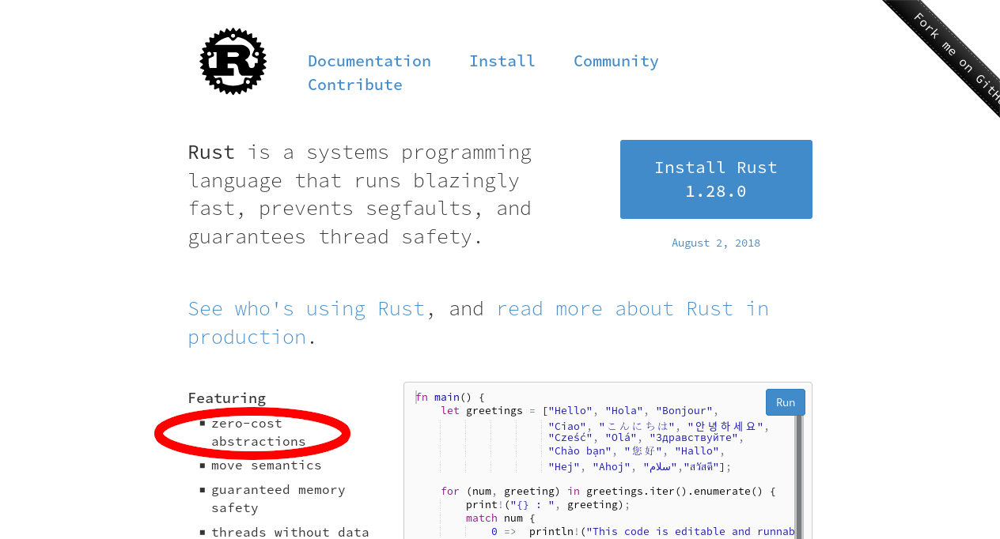

## RustConf 2018

James Munns

@bitshiftmask

james.munns@ferrous-systems.com

::: notes

* Who Am I?
* Sort of about Embedded Systems
* Get the compiler to understand what you're trying to do
* Enforce at compile time
* Zero Cost Abstractions

:::

<!--
Who am I?

So, today's talk is sort of about embedded systems, but really the cool thing we're going to talk about is how to get the compiler to understand more about what you are trying to do with your program, and enforce your rules at compile time, rather than writing code that checks itself at run time.

In Rust, this isn't a new concept, "Zero Cost Abstractions" are the first feature listed on the home page:
-->

---



::: notes

* Cost => overhead at runtime
    * memory or CPU cycles
* Reduce monetary costs
    * lower power hardware
    * still gets the job done
* CPU cycles means battery life

:::

<!--
This means that we are able to make some kind of abstraction, for zero cost. The cost we are talking about here is overhead at runtime, either in memory used or cpu cycles when you are running your program.

For embedded systems, you are always trying to reduce your costs, typically by using hardware with lower features, while still operating as it is supposed to. The lower the number of CPU cycles needed per second, or the lower the maximum amount of RAM or Flash storage is needed, the lower the parts necessary to build the system will cost.

CPU cycles also have another cost for embedded systems. The more the CPU does, the more battery it uses, making battery life shorter.
-->

---

## Rust? for Embedded?

> embedded rust isn't a new idea

---


---

## Rust in 2018

> stabilizing things behind the scenes

::: notes

* Stabilizing language items
* Wierdness
    * outside an operating systems
    * when you panic
    * how to start code on boot

:::

<!--
Rust as a language has defined and is stabilizing all of the language items needed in an embedded context, mostly around the wierdness that is running code outside of an operating system, like what to do if your code panics, or how to start your code after you first boot up
-->

---

## LLVM

> if they can do it, so can we!

::: notes

* Compiler Backend
* Supports uC, C and C++ background

:::

<!--
LLVM already supports microcontrollers, thanks to its' C and C++ usage
-->

---

`#![no_std]`

> where we're going, we don't need operating systems

::: notes

* No operating systems
* Can't pretend there is one
* Standard library
    * we can throw it out!
    * Add it back

:::

<!--
We don't have an operating system, or anything we can pretend is one, so it would be hard to use the standard library, but we can throw it all out if we need, and add back just the parts we want
-->

---

```
$ rustup default stable
$ cargo build --target thumbv7em-none-eabihf
```

> building firmware doesn't have to be complex
>
> batteries included

::: notes

* 2018 edition of Rust
* Keep good stuff
    * Package Management
    * Borrow Checker
    * Type System

:::

<!--
Oh, and as of the 2018 edition of Rust, you can pretty much just type `cargo build --target thumbv7em-none-eabihf`, and get a microcontroller binary out, while still keeping all of the things that are nice about Rust like helpful compiler warnings, cargo for managing packages, the borrow checker, the type system, etc.
-->

---

## Embedded Systems

> computers you don't sit in front of

::: notes

* Embedded Systems is broad
* One primary task
* TV Remote to Rocket Engine Control System

:::

<!--
So, embedded systems is a pretty broad term, but it generally covers any system containing hardware and software that is built for one primary task. This is different to devices like phones, laptops, desktops, and servers, which are General Purpose Computers. They are built to run any number of different applications. Unfortunately, the term "embedded systems" covers everything from a TV remote to a rocket engine.
-->

---

## Microcontrollers

> phenomenal hardware powers
>
> itty bitty living space

::: notes

:::

---


<!--
We'll narrow our scope down the the lower chunk of that range, focusing down on Microcontrollers systems, where even the smallest amount of overhead can be pretty painful. Microcontrollers typicallly have:

* No operating system, or only a minimal one that provides threads and timers
* Single Core, 32 bit CPUs, with 16-600 MHz clock speeds
* 20K-512M of SRAM memory
* 20K-512M of Flash storage

> This covers a huge chunk of devices you might not even think of as individual computers. This could be things like the Thermostat on your wall, a fitness tracker, a Yubikey, or a washing machine.
-->

---

## Peripherals

> connecting your CPU to the physical world

::: notes

* More than just CPU and RAM
* Peripherals
    * Interact with Hardware and the Real World
    * Interact with Sensors, Motors, Bluetooth Radios
* Like a GPU
    * Hand off processing
    * Do something else, or do nothing
    * Save power

:::

<!--
Most Microcontrollers have more than just a CPU and RAM, they also come with a bunch of stuff called Peripherals which are useful for interacting with other hardware, like sensors, bluetooth radios, screens, or touch pads. These peripherals are great because you can offload a lot of the processing to them, so you don't have to handle everything in software. Kind of like offloading graphics processing to a video card, so your CPU can spend it's time doing something else important, or doing nothing so it can save power.
-->

---

## Hardware API

> herding bits

::: notes

* Unlike GPU, no software API like Vulcan or OpenGL
* Exposed as chunks of memory at arbitrary locations
* We call this...

:::

<!--
However, unlike graphics cards, which typically have a Software API like Vulkan, Metal, OpenGL, or DirectX, peripherals are exposed to our CPU with a hardware interface, which is mapped to a chunk of the memory. Because of this, we call these Memmory Mapped Peripherals.
-->

---

## Memory Mapped Peripherals

> `0x2000_0000` is a real place
>
> `0x0000_0000` is too

::: notes

* Both of these addresses are a real thing
* Linear memory address, from 0 to 0xFFFF_FFFF (32 bit processors)
* Only a couple hundred kilobytes of it are used for actual memory

:::

<!--
On a microcontroller, when you write some data to a certain address, like `0x2000_0000`, or even `0x0000_0000`, you're really writing to that address. There isn't anything like an MMU which is abstracting one chunk of memory to some other virtual address.

Because 32 bit microcontrollers have this real and linear memory space, from `0x0000_0000`, and `0xFFFF_FFFF`, and they only generally use a few hundred kilobytes of it for actual memory, there is lots of room left over. Instead of ignoring that space, Microcontroller designers instead put the interface for parts of the hardware, like peripherals, in certain memory locations. This ends up looking something like this:
-->

---


::: notes

* Hardware developers decided to repurpose that space
* So this ends up looking like this:

:::

---


::: notes

* Memory here, flash over here, serial port over there
* To configure something? Write to arbitrary memory locations!
* To use something? Write to arbitrary memory locations!

:::

<!--
So for example, if you want to send 32 bits of data over a serial port, you write to the address of the serial port output buffer, and the Serial Port Peripheral takes over and sends out the data for you automatically. If you want to turn an LED on? You write one bit in a special memory address, and the LED turns on.

Configuration of these peripherals works the same. Instead of calling a function to configure some peripheral, they just have a chunk of memory which serves as the hardware API. Write `0x8000_0000` to this address, and the serial port will send data at 1 Megabit per second. Write `0x0800_0000` to this address, and the serial port will send data at 512 Kilobits per second. Write `0x0000_0000` to another address, and the serial port gets disabled. You get the idea. These configuration registers look a little bit like this:
-->

---


::: notes

* Important part: Values, at location
* Same for Assembly, C, or Rust

:::

<!--
This interface is how you interact with the hardware, no matter what language you are talking about. Assembly, C, and also Rust.
-->

---

## Now what?

> write code!

::: notes

* Arbitrary Locations => Unsafe
* Could look like this:

:::

<!--
Great! We have all of the superpowers of Rust, but how do we interact with those peripherals? They are just arbitrary memory locations, and dereferencing those would be `unsafe`! Do we need to do something like this every time we want to use a peripheral?
-->

---

```rust
use core::ptr;
const SER_PORT_SPEED_REG: *mut u32 = 0x4000_1000 as _;

fn read_serial_port_speed() -> u32 {
    unsafe { // <-- :(
        ptr::read_volatile(SER_PORT_SPEED_REG)
    }
}
fn write_serial_port_speed(val: u32) {
    unsafe { // <-- :(
        ptr::write_volatile(SER_PORT_SPEED_REG, val);
    }
}
```

::: notes

* Messy
* Not very Rusty
* Lets try something else...

:::

<!--
This is a little messy, so the first reaction might be to wrap these related things up in to a `struct` to organize them better. Maybe you would come up with something like this:
-->

---

```rust
use core::ptr;

struct SerialPort;

impl SerialPort {
    const SER_PORT_SPEED_REG: *mut u32 = 0x4000_1000 as _;
    pub const SER_PORT_SPEED_HI: u32 = 0x8000_0000;
    pub const SER_PORT_SPEED_LO: u32 = 0x0800_0000;

    fn new() -> SerialPort {
        SerialPort
    }
```

---

```rust
fn read_speed(&self) -> u32 {
    unsafe {
        ptr::read_volatile(Self::SER_PORT_SPEED_REG)
    }
}

fn write_speed(&mut self, val: u32) {
    unsafe {
        ptr::write_volatile(Self::SER_PORT_SPEED_REG, val);
    }
}
```

::: notes

* A little better
* This works!

:::

<!--
And this is a little better! We've hidden that random looking memory address, and presented something that feels a little more rusty. We can even use our new interface:
-->

---

```rust
fn do_something() {
    let mut serial = SerialPort::new();

    let speed = serial.read_speed();
    // Do some work
    serial.write_speed(speed * 2);
}
```

::: notes

* Problem is you can make these anywhere
* When you can make these anywhere, you have aliased pointers!

:::

<!--
But the problem with this is that you can create one of these structs anywhere! Imagine this:
-->

---

```rust
fn do_something() {
    let mut serial = SerialPort::new();
    let speed = serial.read_speed();

    // Be careful, we have to go slow!
    if speed != SerialPort::SER_PORT_SPEED_LO {
        serial.write_speed(SerialPort::SER_PORT_SPEED_LO)
    }
    // First, send some pre-data
    something_else();
    // Okay, lets send some slow data
    // ...
}
```

---

```rust
fn something_else() {
    let mut serial = SerialPort::new();
    // We gotta go fast for this!
    serial.write_speed(SerialPort::SER_PORT_SPEED_HI);
    // send some data...
}
```

::: notes

:::

<!--
In this case, if we were only looking at the code in `do_something()`, we would think, we are definitely sending our serial data slowly, why isn't that thing working?

In this example, it is easy to see. However, once this code is spread out over multiple modules, drivers, developers, and days, it gets easier and easier to make these kinds of mistakes.
-->

---

## This smells like mutable global state

> hardware is basically nothing but mutable global state

---

## What are our rules?

---

We should be able to share any number of read-only accesses to these peripherals

---

If something has read-write access to a peripheral, it should be the only reference

---

# Part I: The Borrow Checker

> ownership and borrows

::: notes

* Already does what the borrow checker does!
* ownership and borrowing of peripherals
* For this to work, only a single instance
* Hardware only has one instance
* But how in code?

:::

<!--
Which, sounds suspiciously exactly like what the Borrow Checker does already!

Imagine if we could pass around ownership of these peripherals, or offer immutable or mutable references to them?

Well, we can, but for the Borrow Checker, we need to have exactly one instance of each peripheral, so Rust can handle this correctly. Well, luckliy in the hardware, there is only one instance of this specific serial port, but how can we expose that in code?
-->

---

## Singletons

> In software engineering, the singleton pattern is a software design pattern that restricts the instantiation of a class to one object.

https://en.wikipedia.org/wiki/Singleton_pattern

::: notes

* Old concept
* But how in Rust?

:::

---

```rust
static mut THE_SERIAL_PORT: SerialPort = SerialPort;

fn main() {
    let _ = unsafe {
        THE_SERIAL_PORT.read_speed();
    }
}
```

> close, but not quite there

::: notes

* Mutable Global Variable
* Unsafe to touch it, always
* Visible everywhere
* No help from the borrow checker

:::

<!--
We could make everything a public static, like this

But this has three problems:

1. We have to use `unsafe` every time we touch a mutable static value
2. Everyone still has access, and could make their own instance
3. We can't use the borrow checker for this!
-->

---

```rust
struct Peripherals {
    serial: Option<SerialPort>,
}
impl Peripherals {
    fn take_serial(&mut self) -> SerialPort {
        let p = replace(&mut self.serial, None);
        p.unwrap()
    }
}
static mut PERIPHERALS: Peripherals = Peripherals {
    serial: Some(SerialPort),
};
```

> take what you need, but only once

---

```rust
fn main() {
    let serial_1 = unsafe { PERIPHERALS.take_serial() };
    // This panics!
    // let serial_2 = unsafe { PERIPHERALS.take_serial() };
}
```

> small runtime overhead, big impact

---

```rust
#[macro_use(singleton)]
extern crate cortex_m;

fn main() {
    // OK if `main` is executed only once
    let x: &'static mut bool =
        singleton!(: bool = false).unwrap();
}
```

[cortex_m docs](https://docs.rs/cortex-m/0.5.2/cortex_m/macro.singleton.html)

---

```rust
// cortex-m-rtfm v0.3.x
app! {
    resources: {
        static RX: Rx<USART1>;
        static TX: Tx<USART1>;
    }
}
fn init(p: init::Peripherals) -> init::LateResources {
    // Note that this is now an owned value, not a reference
    let usart1: USART1 = p.device.USART1;
}
```

[japaric.io rtfm v3](https://blog.japaric.io/rtfm-v3/)

---

## But why?

> how do singletons make a difference?

---

```rust
impl SerialPort {
    const SER_PORT_SPEED_REG: *mut u32 = 0x4000_1000 as _;

    fn read_speed(
        &self // <------ This is really, really important
    ) -> u32 {
        unsafe {
            ptr::read_volatile(Self::SER_PORT_SPEED_REG)
        }
    }
}
```

---

```rust
fn main() {
    let serial_1 = unsafe { PERIPHERALS.take_serial() };

    // you can only read what you have access to
    let _ = serial_1.read_speed();
}
```

---

This is allowed to change hardware settings:

```rust
fn setup_spi_port(
    spi: &mut SpiPort,
    cs_pin: &mut GpioPin
) -> Result<()> {
    // ...
}
```

This isn't:

```rust
fn read_button(gpio: &GpioPin) -> bool {
    // ...
}
```

---

> enforce whether code should or should not make changes to hardware
>
> at **compile time**<sup>\*</sup>

---

<sup>\*</sup>: only works across one application, but for bare metal systems, we usually only have one anyway

---

## Before you worry

> you don't have to write all of that code
>
> this is **rust**. there's a tool for that
>
> it's called svd2rust, and it turns XML files into rust code. like bindgen, but for hardware

---

## Now that peripherals are structs...

> what else can we do with Rust now?

---

# Part II: The Type System

> putting those strong types to work

---

## GPIOs

> take things one bit (of input or output) at a time

---

```rust
struct GpioPin; struct InputGpio; struct OutputGpio;

impl GpioPin {
    fn into_input(self) -> InputGpio {
        self.set_input_mode();
        InputGpio
    }
    fn into_output(self) -> OutputGpio {
        self.set_output_mode();
        OutputGpio
    }
}
```

---

```rust
impl LedPin {
    fn new(pin: OutputGpio) -> Self { ... }
    fn toggle(&mut self) -> bool { ... }
}

fn main() {
    let gpio_1 = unsafe { PERIPHERALS.take_gpio_1() };
    // This won't work, the types are wrong!
    // let led_1 = LedPin::new(gpio_1);
    let mut led_1 = LedPin::new(gpio_1.into_output());
    let _ = led_1.toggle();
}
```

---

## Enforce design contracts

> entirely at compile time
>
> no runtime cost
>
> no room for human error

---

## "no runtime cost"?

```rust
use core::mem::size_of;

let _ = size_of::<GpioPin>();     // == 0
let _ = size_of::<InputGpio>();   // == 0
let _ = size_of::<OutputGpio>();  // == 0
let _ = size_of::<()>();          // == 0
```

---

## Zero Sized Types

```rust
struct GpioPin;
```

> acts real at compile time
>
> doesn't exist in the binary
>
> no RAM, no CPU, no space

---

## Can we do more with types?

> oh, you bet we can

---

## What if our `OutputGpio` has multiple modes?

> (it does)

---

```rust
pub struct PushPull;  // good for general usage
pub struct OpenDrain; // better for high power LEDs

pub struct OutputGpio<MODE> {
    _mode: MODE
}

impl<MODE> OutputGpio<MODE> {
    fn default() -> OutputGpio<OpenDrain> { ... }
    fn into_push_pull(self) -> OutputGpio<PushPull> { ... }
    fn into_open_drain(self) -> OutputGpio<OpenDrain> { ... }
}
```

---

```rust
/// This kind of LED only works with OpenDrain settings
struct DrainLed {
    pin: OutputGpio<OpenDrain>,
}

impl DrainLed {
    fn new(pin: OutputGpio<OpenDrain>) -> Self { ... }
    fn toggle(&self) -> bool { ... }
}
```

---

```rust
/// This kind of LED works with any output
struct LedDriver<MODE> {
    pin: OutputGpio<MODE>,
}

/// Generically support any OutputGpio variant!
impl<MODE> LedDriver<MODE> {
    fn new(pin: OutputGpio<MODE>) -> LedDriver<MODE> { ... }
    fn toggle(&self) -> bool { ... }
}
```

---

# Part III: The Trait System

> traits of a successful project

---

## Building something bigger

> drivers that work for more than one chip

---


::: notes

* Device Crates (one per chip)
* HAL implementation crates (one per chip)
* embedded-hal (only one)
* Driver Crates (one per external component)

:::

---

```rust
/// Single digital push-pull output pin
pub trait OutputPin {
    /// Drives the pin low
    fn set_low(&mut self);

    /// Drives the pin high
    fn set_high(&mut self);
}
```

[rust-embedded/embedded-hal](https://github.com/rust-embedded/embedded-hal/blob/master/src/digital.rs)

---

```rust
impl<MODE> OutputPin for OutputGpio<MODE> {
    fn set_low(&mut self) {
        self.set_pin_low()
    }

    fn set_high(&mut self) {
        self.set_pin_high()
    }
}
```

> this goes in your chip crate

---

```rust
impl<SPI, CS, E> L3gd20<SPI, CS>
where
    SPI: Transfer<u8, Error = E> + Write<u8, Error = E>,
    CS: OutputPin,
{
    /// Creates a new driver from a SPI peripheral
    /// and a NCS pin
    pub fn new(spi: SPI, cs: CS) -> Result<Self, E> {
        // ...
    }
    // ...
}
```

[japaric/l3gd20](https://github.com/japaric/l3gd20/blob/master/src/lib.rs)

---

## N\*M <<< N+M

> to re-use a driver, just implement the embedded-hal interface

---

## Outro

> all good things must end

---

## Ownership and Borrowing

> treat hardware resources the way you treat any other struct. let the compiler manage who has access to what

---

## The Type System

> use types to enforce state transitions, pre-conditions, and post-conditions. stop trying to keep that all in your head or in the comments

---

## The Trait System

> enable code reuse for your embedded projects. no more copy and pasting from project to project

---

## Rust, Cargo, Community

> take advantage of modern language features, package management, tooling, and a group of people willing to work **with** you

---

## Option&lt;T&gt;

> you don't have to use all of this...

::: notes

It's important to note that you don't have to do any of this stuff. If you're making a simple project where you blink an LED, or read some data off a serial port, or build a robot to brush your teeth, this could all feel like overkill!

If you are fine with wrapping your register interactions in unsafe everywhere you use them, thats fine! You **will** need to manually keep track of what you do with your hardware, but that doesn't leave us any worse off than where we are in languages like C, and you still get to keep all of the rest of the Rust goodies like cargo and interators and match statements.

But, if you are a library writer, providing code for other people to use, why wouldn't you want to give them sane defaults, or good rules (or at least suggestions) on how to use the hardware?

People pick up new hardware all of the time, and every piece of hardware is different. I've misremembered how things work more commonly than I've gotten things right the first time. If the people who know the most about a piece of hardware have the tools to make things easier and more foolproof for the people who use that hardware, I think we could make getting in to hardware a lot more accessible for developers to get things right.

:::

---

# Thank you!

---

## Plugs


<font size="1">icon by [Freepik] from [flaticon.com]</font>

[Freepik]: https://www.flaticon.com/authors/freepik
[flaticon.com]: https://www.flaticon.com

---


## The Embedded Working Group

---

## Ferrous Systems


---

> Getting Something For Nothing

James Munns

@bitshiftmask

james.munns@ferrous-systems.com

---

# Secret Bonus Slides

---

```rust
pub struct OutputGpio<MODE> {
    _mode: MODE
}
```

```rust
pub struct Output<MODE> {
    _mode: PhantomData<MODE>,
}
```

todo: explain these differences

---

Wait, but if you generate all the code for the peripherals, how do you add functionality? or create instances?

---

```rust
// in crate `nrf52`, generated by svd2rust
pub struct PIN_CNF {
    register: ::vcell::VolatileCell<u32>,
}

impl PIN_CNF {
    pub fn modify<F>(&self, f: F) { ... }
    pub fn read(&self) -> R { ... }
    pub fn write<F>(&self, f: F) { ... }
    pub fn reset(&self) { ... }
}
```

---

```rust
fn main() {
    let _ = PIN_CNF {
        register: VolatileCell::new(10)
    };
}
```

```
error[E0451]: field `register` of struct `nrf52::PIN_CNF` is private
  --> src/main.rs:22:9
   |
22 |         register: VolatileCell::new(10)
   |         ^^^^^^^^^^^^^^^^^^^^^^^^^^^^^^^ field `register` is private
```

---

## lets try that again

---

```rust
// src/p0/mod.rs
pub struct PIN_CNF {
    register: ::vcell::VolatileCell<u32>,
}
```

> this is our pin configuration register

---

```rust
// src/p0/mod.rs
#[repr(C)]
pub struct RegisterBlock {
    _reserved0: [u8; 1284usize],
    pub out: OUT,
    pub detectmode: DETECTMODE,
    _reserved1: [u8; 472usize],
    pub pin_cnf: [PIN_CNF; 32],
}
```

> this is the larger block of registers that the PIN_CNF array lives in

---

```rust
pub struct P0 {
    _marker: PhantomData<*const ()>,
}
impl P0 {
    pub fn ptr() -> *const p0::RegisterBlock {
        1342177280 as *const _
    }
}
impl Deref for P0 {
    fn deref(&self) -> &p0::RegisterBlock {
        unsafe { &*P0::ptr() }
    }
}
```

---

```rust
fn main() {

}
```

---

## Extension Traits

> like DLC for someone else's code
